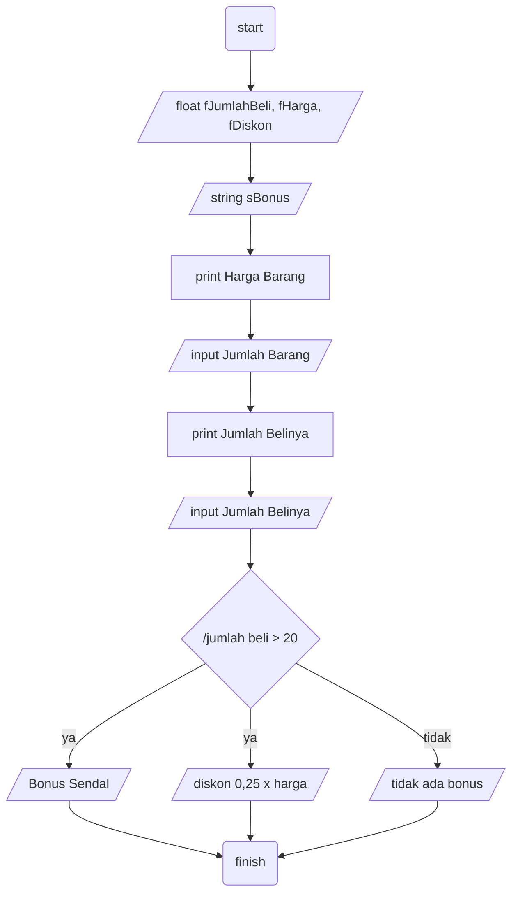

```mermaid
   flowchart TD;
    A(start) -->B[/float fJumlahBeli, fHarga, fDiskon/];
    B --> C[/string sBonus/];
    C --> D[print Harga Barang];
    D --> E[/input Jumlah Barang/];
    E --> F[print Jumlah Belinya];
    F --> G[/input Jumlah Belinya/];
    G --> H{/jumlah beli > 20};
    H --ya--> I[/Bonus Sendal/];
    H --ya--> J[/diskon 0,25 x harga/];
    H --tidak--> K[/tidak ada bonus/];
    I -->0(finish)
    J --> 0
    K --> 0
```